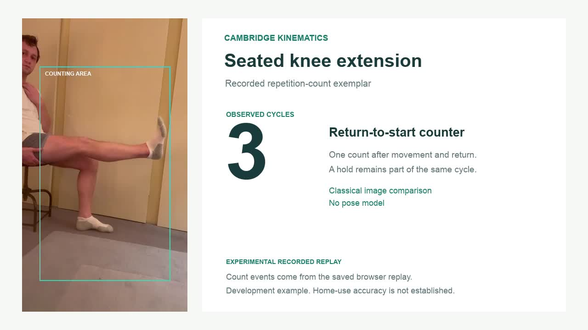

# Recorded examples

## Experimental repetition counting

[Watch the exemplar](https://mm117868-svg.github.io/KNEORA/examples/rep-count/) · [Files and method notes](examples/rep-count/README.md)

Five seated knee extensions with holds, with the observed count displayed beside the recording. The overlay follows saved event times from the experimental image-comparison counter. This recorded development example is not an independent validation of accuracy or a demonstration of every counting mode in the patient app.
