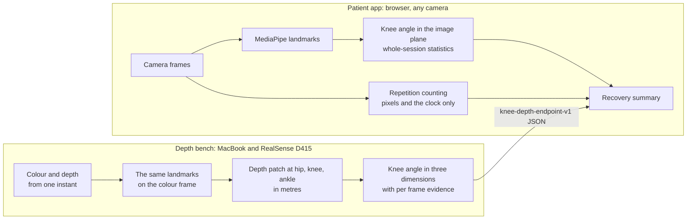

# KNEORA

Home knee rehabilitation after total knee replacement, from Cambridge Kinematics.
One repository for three pieces of software that used to live apart:

| Path | What it is | Where it came from |
| --- | --- | --- |
| `/` (`index.html` and the modules beside it) | **The patient app.** Runs in a browser with any camera: a week by week programme, a whole-session knee angle from MediaPipe, repetition counting from pixels alone, a recovery summary, questionnaires and a physio report. | `mm117868-svg/knee-recovery`, with its full history |
| `depth-bench/` | **The depth bench.** A RealSense D415 on a MacBook measures the same knee twice from one frame, in the image plane and in metres from depth, and writes a file the app imports. A bench instrument, not the product. | Matthew's bench laptop; it was in no repository before |
| `legacy/vivek-tkr-rehab/` | **Vivek's original page**, the single file the app grew out of. Archived as text, not run. | `viviscool/knee_recovery`, with its history |

This is a development prototype. It has not been clinically validated for
diagnosis or treatment decisions, and nothing here replaces a physiotherapist's
or surgeon's plan.

Live app: <https://mm117868-svg.github.io/KNEORA/>

## How the parts fit



The arrow between the boxes is a file format, and it is tested from both ends:
`depth-bench/tests/test_contract.py` and `tests/depth-bench-contract.test.mjs`
read the same fixture, so neither side can change the format or the acceptance
rules alone. The bench also finds joints with the pose model the app serves,
`models/pose_landmarker_full.task`.

## Run it

```bash
make help        # the targets
make test        # app checks (Node) and depth bench checks (Python)
make serve       # the app on http://localhost:8000
```

On a Mac, double-clicking `Open the app.command` does the same as `make serve`
and opens the browser. A camera only works on `localhost` or over https, which
is why a local server or the live link is needed and opening `index.html` from
disk is not enough.

- The app: [PATIENT-APP.md](PATIENT-APP.md), then the notes it links to.
- What is drawn over the picture, and why the picture stays smooth:
  [LIVE-DISPLAY.md](LIVE-DISPLAY.md).
- The depth bench, including how to get the D415 working on a Mac:
  [depth-bench/README.md](depth-bench/README.md).
- The recorded-exercise analyser: [video-analysis/README.md](video-analysis/README.md).

## Rules the app keeps

These are in the code already (`kneerec.js`, `kneetrack.js`, the exercise library
in `index.html`) and are repeated here because they decided what was combined.

1. Measurement and counting are separate layers on the same frames. Measurement
   goes from landmarks to a knee angle to whole-session statistics and never
   marks where a repetition starts or ends. Counting sees pixels and the clock
   only, never landmarks, joints or angles.
2. Nothing scores a repetition or corrects the patient during an exercise.
3. The app never reads MediaPipe's predicted depth. Depth comes from a sensor
   built to measure it, which is what the bench is for.
4. The patient chooses the operated leg. The app does not guess, and only that
   leg is ever outlined on the picture.
5. MediaPipe, its models and the tracking scripts are pinned copies in this
   repository, so the app's behaviour changes only when this repository does.

## What was combined, and what was left out

**From Vivek's page.** The app already had its phases, library shape, icons and
safety notice. The two exercises it lacked, Forward step-up and Functional bend,
are now in the library as pending cards. His live coaching against a target, his
target-gated counting from the landmark trace and his automatic choice of leg
were left out under rules 1, 2 and 4. His knee angle sum was left out because it
is wrong on any picture that is not square: see
[legacy/vivek-tkr-rehab/README.md](legacy/vivek-tkr-rehab/README.md).

**From the depth bench.** The code came across as it stood, then three things
changed: its paths now stay inside this repository, its export is tied to the
app's importer by the shared fixture, and its Mac install notes were corrected.

## Known limits

- The knee angle is unsigned, in the app and in the bench. It cannot show
  hyperextension, and near a straight knee any noise reads as bend.
- The bench reads depth at three landmarks. It captures one hold at a time, and
  its correction from the skin surface to the joint centre is off until it has
  been measured on a jig.
- Counts are experimental movement attempts, not clinical range or form
  assessments. The position models came from a small set of recordings of one
  person.
- An open palm two metres or more from the camera can be too small for the hand
  model to find. The Start button remains available.
- Records stay in the browser that made them. There is no account and no sync.

## Ownership

© 2026 Cambridge Kinematics Limited. All rights reserved. Cambridge Kinematics
is a trade mark of Cambridge Kinematics Limited (UK application UK00004438535,
registration pending). Third party components keep their own licences:
`vendor/speech/NOTICE.txt`, `vendor/track/NOTICE.txt`,
`exercise-guides/vendor/LICENSE`, `video-analysis/THIRD_PARTY_NOTICES.md` and
`video-analysis/vendor/LICENSE`.
